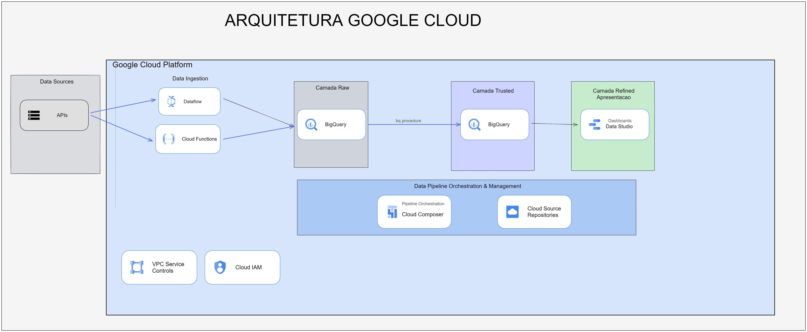

# Diagrama da Ingestão

Eu desenheir 2 cenários que podem alterar conforme a demanda

## Passo 1 - Ingestão Camada Raw
Nessa etapa os dados podem variar de tamanho e origem, sendo assim 
os processos batch são orquestrados pelo composer(Airflow) e os processos assincronos
podem ser disparados pelo cloud function. Outro ponto que eu não coloquei é se houver stream, nesse caso
pode haver um mensageiro Pub/Sub esperando algo na fila chegar pra disparar a ingestão via dataflow.

Cenário 1:
- Descrição: Dataflow efetua ingestão dos dados no bigquery
- Requisito: Fluxo que exija processamento alto

Cenário 2: 
- Descrição: Cloud Function efetua ingestão dos dados no bigquery
- Requisito: Fluxo que exija pouco procesamento

## Passo 2 - Ingestão Camada Trusted
Os dados serão inseridos na camada trusted com os seus devidos formatos, depedendo da maturidade da empresa, desnormalizados 
com todos dados que servirão pra área de negócio consumir
A ingestão é feita por procedures armazenadas no bigquery orquestradas pelo composer (Airflow)

## Passo 3 - Camada de Apresentação
Nessa camada pode se plugar qualquer ferramenta de análise tableu, Click, PowerBI e etc. Dependendo 
de como os dados são usados, existe a necessidade de criar uma terceira camada, pronta para o dashboard ou 
para a equipe de Data Science aplicar modelos.

## Pontos Consideração
- A interção com o ambiente on premisse se dá por uma vpn
- Armazenamento dos códigos pode se dar no próprio Cloud Source Repository/ GitHub
- Dados sensíveis ficarão em projetos apartados no próprio bigquery, efetuando divisão das camadas em raw e raw sensível, trusted e trusted sensível. Os grupos de acesso permitirão o acesso as tabelas que estiverem em determinado dataset e projeto